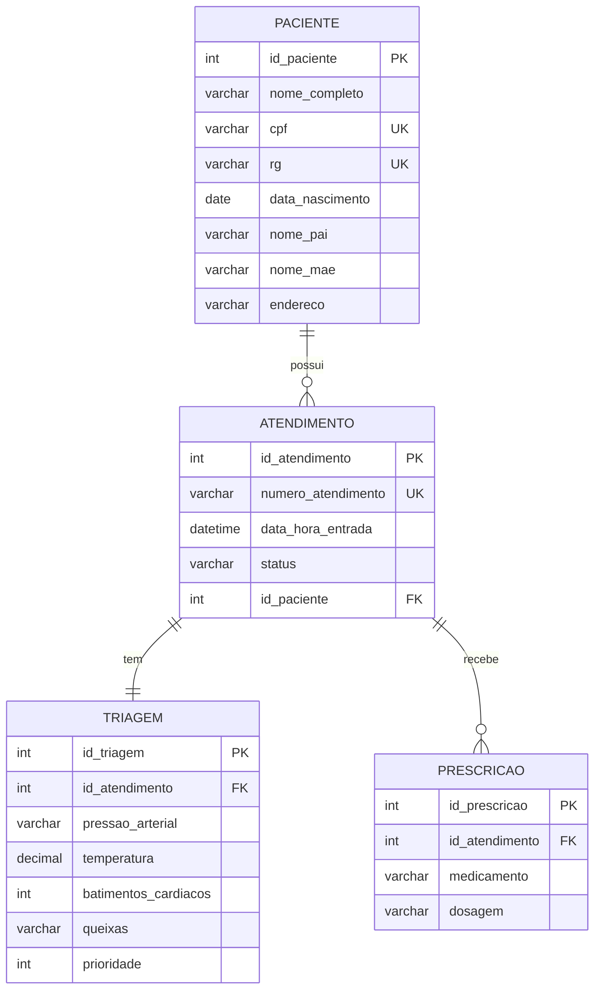

# Sistema de Atendimentos de Pronto Socorro

Sistema web para controle do fluxo de atendimento em um Pronto Socorro, da chegada do paciente na recepção até a alta médica. Projeto Integrador 2 — Sistemas de Informação, PUC-Campinas.

## O processo

1. **Recepção** — cadastra o paciente e abre o atendimento, gerando um número único (ex: `AT0001`).
2. **Triagem (Enfermagem)** — registra sinais vitais e classifica o risco conforme o Protocolo de Manchester.
3. **Atendimento médico** — o médico chama por prioridade, registra medicações e confirma a consulta.

## Estrutura do sistema

| Camada | Responsabilidade |
|---|---|
| Front-end | Recepção (incluir/alterar/consultar/cancelar), Triagem (lançar dados vitais), Médico (Painel de Atendimentos + medicações/confirmação) |
| Back-end | Conecta as três interfaces e persiste os dados |
| Banco de dados | Relacional, 4 tabelas: `paciente`, `atendimento`, `triagem`, `prescricao` |

## Modelo de dados

### Notas do modelo

- `atendimento.status` controla o fluxo: `aberto` → `triado` → `confirmado` (ou `cancelado`). A recepção só pode alterar/cancelar enquanto não estiver `confirmado`.
- `triagem` é 1:1 com `atendimento` (`id_atendimento` é `UNIQUE`) — cada atendimento passa pela enfermagem uma única vez.
- `prioridade` guarda a classificação de Manchester como número (1 a 5), não como tabela separada — o back-end faz a conversão cor ↔ número. Isso mantém o `ORDER BY` do Painel do Médico simples, direto no SQL.
- `prescricao` é 1:N — um atendimento pode ter várias medicações lançadas.

## Tecnologias

_Ajustar conforme decisão final da equipe._

- Front-end: HTML, CSS, JavaScript
- Back-end: Node.js / JavaScript
- Banco de dados: SQL relacional
