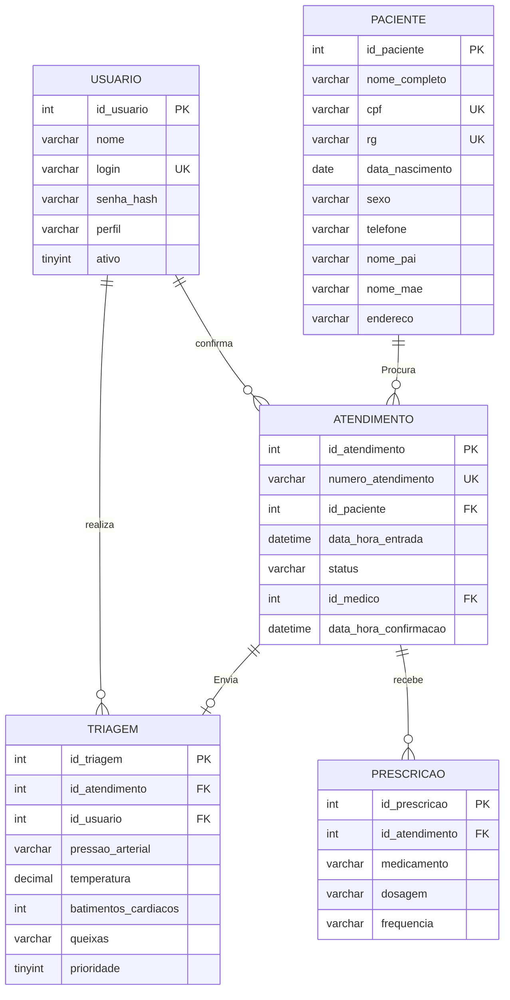

# Sistema de Atendimentos de Pronto Socorro

Sistema web para controle do fluxo de atendimento em um Pronto Socorro, da chegada do paciente na recepção até a alta médica. Projeto Integrador 2 — Sistemas de Informação, PUC-Campinas.

## O processo

1. **Recepção** — cadastra o paciente e abre o atendimento, gerando um número único (ex: `AT0001`).
2. **Triagem (Enfermagem)** — registra sinais vitais e classifica o risco conforme o Protocolo de Manchester.
3. **Atendimento médico** — o médico chama por prioridade, registra medicações e confirma a consulta.

## Estrutura do sistema

| Camada | Responsabilidade |
|---|---|
| Front-end | Recepção (incluir/alterar/consultar/cancelar), Triagem (lançar dados vitais), Médico (Painel de Atendimentos + medicações/confirmação) |
| Back-end | Conecta as três interfaces e persiste os dados |
| Banco de dados | Relacional (MySQL), 5 tabelas: `usuario`, `paciente`, `atendimento`, `triagem`, `prescricao` |

Cada tela exige login. O `usuario.perfil` (`recepcao`, `enfermagem` ou `medico`) define qual interface a pessoa pode acessar.

## Modelo de dados

```mermaid
erDiagram
    PACIENTE ||--o{ ATENDIMENTO : Procura
    ATENDIMENTO ||--o| TRIAGEM : Envia
    ATENDIMENTO ||--o{ PRESCRICAO : recebe
    USUARIO ||--o{ TRIAGEM : realiza
    USUARIO ||--o{ ATENDIMENTO : confirma

    USUARIO {
        int id_usuario PK
        varchar nome
        varchar login UK
        varchar senha_hash
        varchar perfil
        tinyint ativo
    }

    PACIENTE {
        int id_paciente PK
        varchar nome_completo
        varchar cpf UK
        varchar rg UK
        date data_nascimento
        varchar sexo
        varchar telefone
        varchar nome_pai
        varchar nome_mae
        varchar endereco
    }

    ATENDIMENTO {
        int id_atendimento PK
        varchar numero_atendimento UK
        int id_paciente FK
        datetime data_hora_entrada
        varchar status
        int id_medico FK
        datetime data_hora_confirmacao
    }

    TRIAGEM {
        int id_triagem PK
        int id_atendimento FK
        int id_usuario FK
        varchar pressao_arterial
        decimal temperatura
        int batimentos_cardiacos
        varchar queixas
        tinyint prioridade
    }

    PRESCRICAO {
        int id_prescricao PK
        int id_atendimento FK
        varchar medicamento
        varchar dosagem
        varchar frequencia
    }
```

### Notas do modelo

- `usuario` guarda o login simples. A senha fica como hash (bcrypt), nunca em texto puro.
- `paciente` exige pelo menos um documento: `cpf` ou `rg` (CHECK). Se o paciente for menor de 18 anos, `nome_pai` ou `nome_mae` é obrigatório, validado no back-end.
- `atendimento.status` controla o fluxo: `aberto` → `triado` → `confirmado` (ou `cancelado`). A recepção só pode alterar/cancelar enquanto não estiver `confirmado`.
- `atendimento.numero_atendimento` (`AT0001`) é preenchido logo após o INSERT, a partir do `id_atendimento`.
- `atendimento.id_medico` e `data_hora_confirmacao` registram quem confirmou a consulta e quando.
- `triagem` é 1:1 com `atendimento` (`id_atendimento` é `UNIQUE`) — cada atendimento passa pela enfermagem uma única vez. `id_usuario` registra quem fez a triagem e `queixas` guarda as principais queixas em um único campo.
- `prioridade` guarda a classificação de Manchester como número (1 a 5), não como tabela separada — o back-end faz a conversão cor ↔ número. Isso mantém o `ORDER BY` do Painel do Médico simples, direto no SQL.
- `prescricao` é 1:N — um atendimento pode ter várias medicações lançadas (medicamento, dosagem e frequência).
- Os CHECKs (status, perfil, prioridade, faixas de temperatura e batimentos) exigem MySQL 8.0.16 ou superior.

## Tecnologias

_Ajustar conforme decisão final da equipe._

- Front-end: HTML, CSS, JavaScript
- Back-end: Node.js / JavaScript
- Banco de dados: MySQL
