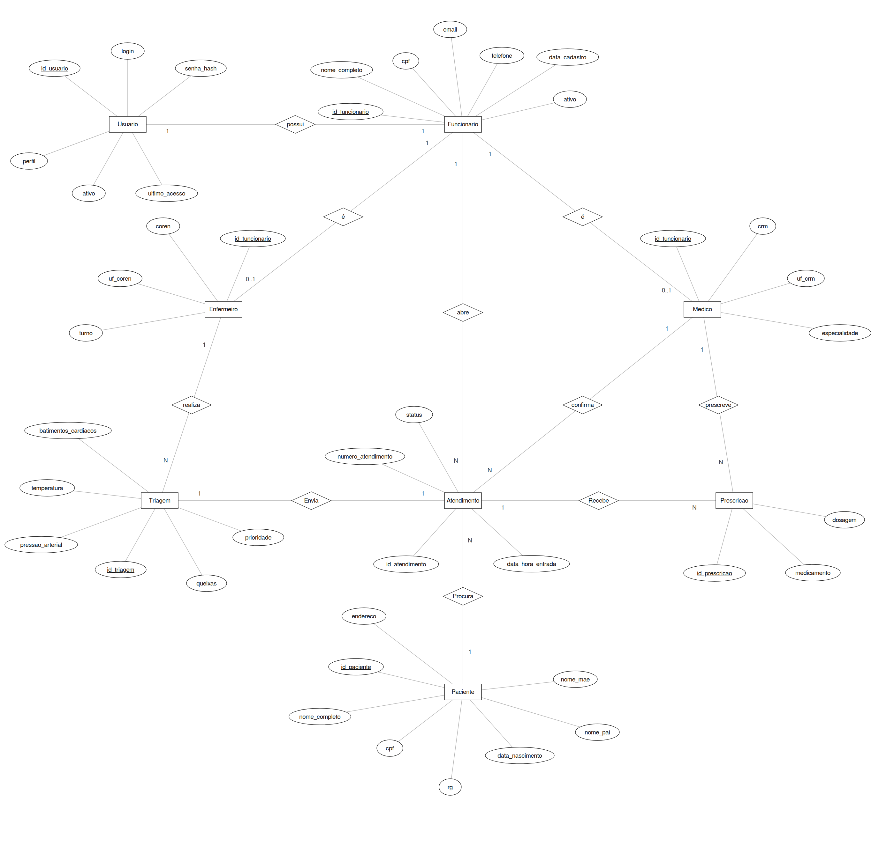
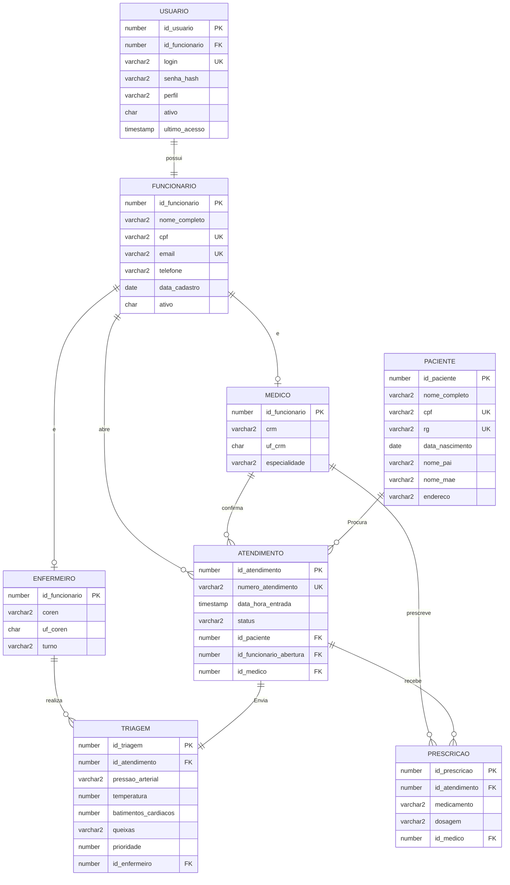

# Sistema de Atendimentos de Pronto Socorro

Sistema web para controle do fluxo de atendimento em um Pronto Socorro, da chegada do paciente na recepção até a alta médica. Projeto Integrador 2 — Sistemas de Informação, PUC-Campinas.

## O processo

0. **Acesso** — cada funcionário entra com login e senha próprios. O perfil (`recepcao`, `enfermagem`, `medico` ou `admin`) define qual tela ele enxerga.
1. **Recepção** — cadastra o paciente e abre o atendimento, gerando um número único (ex: `AT0001`).
2. **Triagem (Enfermagem)** — registra sinais vitais e classifica o risco conforme o Protocolo de Manchester.
3. **Atendimento médico** — o médico chama por prioridade, registra medicações e confirma a consulta.

## Estrutura do sistema

| Camada | Responsabilidade |
|---|---|
| Front-end | Login, Recepção (incluir/alterar/consultar/cancelar), Triagem (lançar dados vitais), Médico (Painel de Atendimentos + medicações/confirmação) |
| Back-end | Autentica o usuário, controla o acesso por perfil, conecta as três interfaces e persiste os dados |
| Banco de dados | Relacional (Oracle), 8 tabelas: `paciente`, `atendimento`, `triagem`, `prescricao`, `funcionario`, `usuario`, `medico`, `enfermeiro` |

## Modelo de dados

Diagrama entidade-relacionamento (MER): `Modelo.png`. Script de criação em Oracle: `banco.md`.

Versão em mermaid:

```mermaid
erDiagram
    USUARIO ||--|| FUNCIONARIO : possui
    FUNCIONARIO ||--o| MEDICO : e
    FUNCIONARIO ||--o| ENFERMEIRO : e
    FUNCIONARIO ||--o{ ATENDIMENTO : abre
    MEDICO ||--o{ ATENDIMENTO : confirma
    MEDICO ||--o{ PRESCRICAO : prescreve
    ENFERMEIRO ||--o{ TRIAGEM : realiza
    PACIENTE ||--o{ ATENDIMENTO : Procura
    ATENDIMENTO ||--|| TRIAGEM : Envia
    ATENDIMENTO ||--o{ PRESCRICAO : recebe

    FUNCIONARIO {
        number id_funcionario PK
        varchar2 nome_completo
        varchar2 cpf UK
        varchar2 email UK
        varchar2 telefone
        date data_cadastro
        char ativo
    }

    USUARIO {
        number id_usuario PK
        number id_funcionario FK
        varchar2 login UK
        varchar2 senha_hash
        varchar2 perfil
        char ativo
        timestamp ultimo_acesso
    }

    MEDICO {
        number id_funcionario PK
        varchar2 crm
        char uf_crm
        varchar2 especialidade
    }

    ENFERMEIRO {
        number id_funcionario PK
        varchar2 coren
        char uf_coren
        varchar2 turno
    }

    PACIENTE {
        number id_paciente PK
        varchar2 nome_completo
        varchar2 cpf UK
        varchar2 rg UK
        date data_nascimento
        varchar2 nome_pai
        varchar2 nome_mae
        varchar2 endereco
    }

    ATENDIMENTO {
        number id_atendimento PK
        varchar2 numero_atendimento UK
        timestamp data_hora_entrada
        varchar2 status
        number id_paciente FK
        number id_funcionario_abertura FK
        number id_medico FK
    }

    TRIAGEM {
        number id_triagem PK
        number id_atendimento FK
        varchar2 pressao_arterial
        number temperatura
        number batimentos_cardiacos
        varchar2 queixas
        number prioridade
        number id_enfermeiro FK
    }

    PRESCRICAO {
        number id_prescricao PK
        number id_atendimento FK
        varchar2 medicamento
        varchar2 dosagem
        number id_medico FK
    }
```

### Notas do modelo

- `atendimento.status` controla o fluxo: `aberto` → `triado` → `confirmado` (ou `cancelado`). A recepção só pode alterar/cancelar enquanto não estiver `confirmado`.
- `triagem` é 1:1 com `atendimento` (`id_atendimento` é `UNIQUE`) — cada atendimento passa pela enfermagem uma única vez.
- `prioridade` guarda a classificação de Manchester como número (1 a 5), não como tabela separada — o back-end faz a conversão cor ↔ número. Isso mantém o `ORDER BY` do Painel do Médico simples, direto no SQL.
- `prescricao` é 1:N — um atendimento pode ter várias medicações lançadas.
- `funcionario` é o cadastro de pessoas. `medico` e `enfermeiro` são especializações (a PK é o próprio `id_funcionario`); recepção e admin são funcionários sem especialização.
- `usuario` guarda o login (1:1 com funcionário) e o `perfil`, que define o que cada um acessa: `recepcao`, `enfermagem`, `medico` ou `admin`. A senha é guardada como hash, nunca pura.
- Rastreabilidade: `atendimento.id_funcionario_abertura` (quem abriu), `triagem.id_enfermeiro` (quem triou), `prescricao.id_medico` e `atendimento.id_medico` (quem prescreveu e quem confirmou).

## Tecnologias

_Ajustar conforme decisão final da equipe._

- Front-end: HTML, CSS, JavaScript
- Back-end: Node.js / JavaScript
- Banco de dados: Oracle (SQL + PL/SQL) — script de criação em `banco.md`
- Hospedagem do banco: _a definir_ (opções: Oracle XE local com Docker, Oracle Cloud Free Tier)
